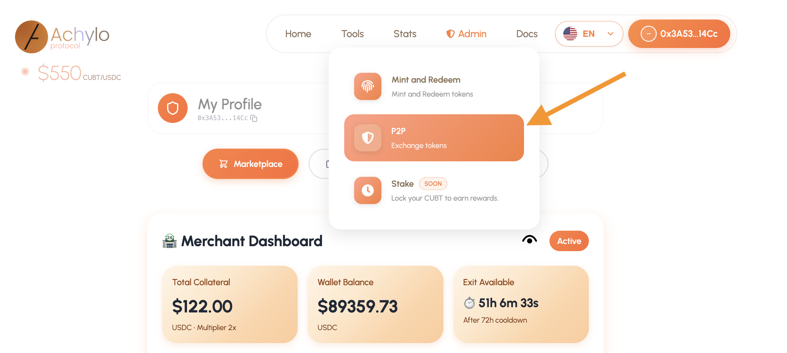

# 🔐 Acceso y Configuración Inicial

### 🌐 Red Disponible
* **Base Sepolia** (Hasta nuevo comunicado).
* ⚠️ **Aviso:** Antes de enviar USDC a tu cartera, verifica siempre la red disponible.

---

## 🚀 Cómo entrar a la aplicación Achylo

1.  **Accede al sitio oficial:** Abre [www.achylo.com](http://www.achylo.com) en tu navegador.
2.  **Conecta tu Wallet:** * Haz clic en el botón **“Connect”**. 
    * Si es tu primera vez, inicia sesión con tu **e-mail preferido**. Se creará automáticamente una Wallet personalizada.
3.  **Recibir Fondos:** * Una vez creada la wallet, estás listo para recibir **USDC** desde otras fuentes (Exchanges u otras wallets).
    * **IMPORTANTE:** Revisa que los fondos sean enviados exclusivamente por la **Red de Base**.
4.  **Iniciar Negociaciones:** * Con la wallet conectada y con fondos, dirígete al menú: `Tools` -> `P2P`.
    * La app mostrará tu dirección y desbloqueará los menús principales.

> **📍 Img. No.1. Ruta P2P.**

---

## 💱 Monedas Fiat Soportadas
El Marketplace P2P acepta múltiples divisas para operar en distintos países:

| Moneda | Descripción |
| :--- | :--- |
| **CUBT** | Peso Cubano Tokenizado (**50% de descuento en fees**) |
| **CUP** | Peso Cubano |
| **MLC** | Moneda Libremente Convertible |
| **USD_CLASICA** | USD modalidad “clásica” (transferencias) |
| **USD** | Dólar estadounidense (Efectivo) |
| **COP** | Peso Colombiano (Efectivo) |
| **EURO** | Euro (Efectivo) |
| **GBP** | Libra esterlina (Efectivo) |
| **CAD** | Dólar canadiense (Efectivo) |
| **MXN** | Peso mexicano (Efectivo) |
| **BRL** | Real brasileño (Efectivo) |
| **PEN** | Sol peruano (Efectivo) |
| **DOP** | Peso dominicano (Efectivo) |
| **PYG** | Guaraní paraguayo (Efectivo) |
| **ECS** | Sucre ecuatoriano |
| **BOB** | Boliviano (Efectivo) |
| **ARS** | Peso argentino (Efectivo) |
| **VES** | Bolívar venezolano (Efectivo) |