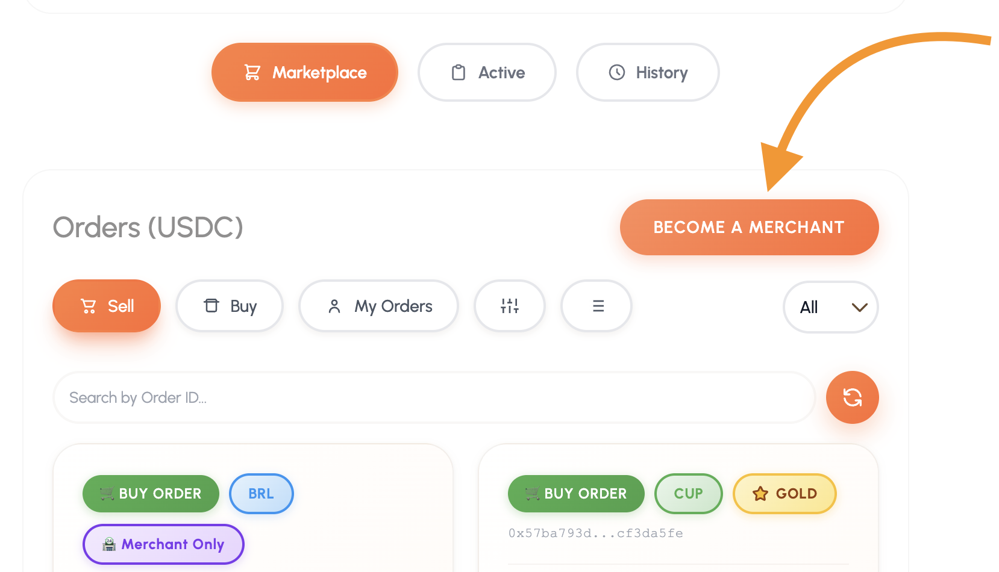
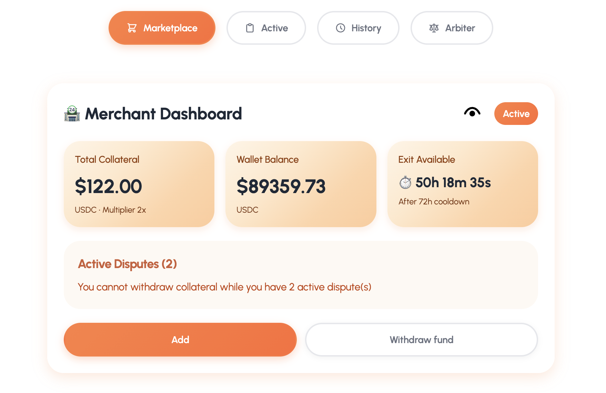

#  Comerciante (Merchant)

## Cómo convertirse en Merchant
Ser **Merchant** te permite tener un rol activo en la plataforma: podrás crear tus propias órdenes públicas y aceptar solicitudes de intercambio de otros usuarios.

### Pasos para el registro:
1.  **Localiza el acceso:** En la página principal del marketplace, busca y haz clic en el botón **“Become a Merchant”**.
2.  **Completa el formulario:** Se abrirá un modal donde deberás depositar un **colateral** en USDC (o el token estable configurado por el protocolo).
3.  **Verifica tu saldo:** Revisa tu balance disponible en la parte superior izquierda del modal para asegurarte de tener fondos suficientes.
4.  **Define la garantía:** Escribe el monto que deseas bloquear como respaldo. 
    * *Nota:* Debe ser al menos el mínimo indicado (por ejemplo, **100 USDC**).
5.  **Finaliza el proceso:** Pulsa en **“Register as Merchant”**.
6.  **Confirmación:** Espera unos segundos hasta ver el mensaje de éxito. La aplicación refrescará tu estado automáticamente.

---

##  Gestión del Colateral

Es importante entender cómo funciona el bloqueo de tus fondos de garantía:

* **Estado de bloqueo:** Mientras mantengas el rol de merchant, el colateral permanecerá bloqueado para asegurar tus operaciones.
* **Retiro de fondos:** Si decides dejar de ser merchant, puedes usar la opción **“Withdraw Fund”**.
* **Periodo de espera (Cooldown):** Existe un tiempo de espera antes de que puedas retirar la totalidad del colateral.
    * ⚠️ **Regla de las 72 horas:** Este bloqueo preventivo solo se activa si has realizado alguna operación de compra o venta en las últimas **72 horas**.

> **Consejo:** Asegúrate de no tener operaciones pendientes antes de iniciar el proceso de retiro para facilitar la liberación de tus fondos.

> **Img No.1. Convertirse en un comerciante.**

> **Img No.2. Convertirse en un comerciante.**