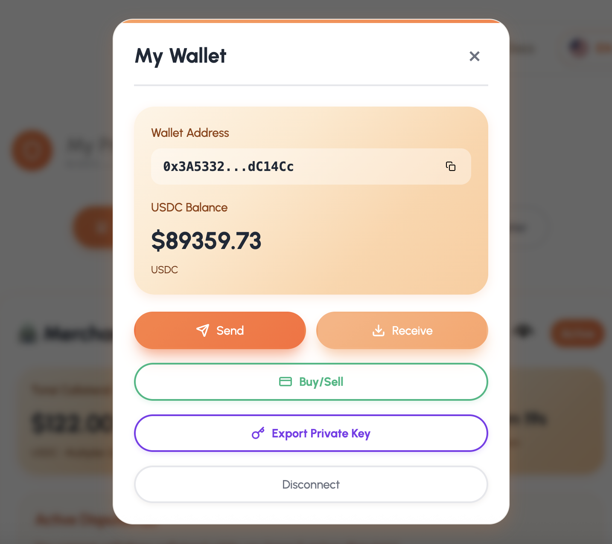

#  Inicio

###  Antes de empezar
Asegúrate de tener **USDC** (token estable) disponible en la red **Base**. Dependiendo de la versión que utilices, puedes obtenerlos de la siguiente manera:

* **Testnet (Base Sepolia):** Puedes usar el contrato de prueba *USDC Achylo* o solicitar tokens de prueba directamente al servicio de soporte.
* **Mainnet (Base):** Compra USDC en un exchange de tu preferencia y envíalo a tu Wallet de Achylo.

---

##  Gestión de Fondos
Puedes adicionar fondos a tu Wallet desde cualquier fuente externa (Exchange u otra wallet).

### Características de tu Wallet:
* **Sin costos extra:** Desde la Wallet puedes recibir y retirar fondos sin comisiones adicionales por parte de la plataforma.
* **Autocustodia total:** Achylo Protocol **no es el dueño** de tu Wallet ni tiene control sobre ella. 
* **Propiedad exclusiva:** Como usuario, eres el único que puede manipular los activos, ya que posees el control total de la misma.

---

##  Interfaz de "My Wallet" (Mi Billetera)

Al abrir tu perfil, verás las siguientes opciones para gestionar tus activos:

### Información de la Cuenta
* **Wallet Address (Dirección):** Tu identificador único en la red. Incluye un botón para copiar la dirección completa.
* **USDC Balance:** Muestra la cantidad total de dólares digitales (USDC) que posees actualmente.

### Funciones Principales
* **Send (Enviar):** Utilízalo para transferir tus USDC a otras billeteras o exchanges.
* **Receive (Recibir):** Muestra los datos necesarios para que otros te envíen fondos.
* **Buy/Sell (Comprar/Vender):** Acceso directo para adquirir más tokens o liquidar tus activos.

### Seguridad y Configuración
* **Export Private Key (Exportar Llave Privada):** Permite obtener la clave secreta de tu billetera. 
    *  **Atención:** Nunca compartas esta llave; quien la tenga posee el control total de tu dinero.
* **Disconnect (Desconectar):** Finaliza la sesión de tu billetera en la dApp para mayor seguridad.

> **Nota:** La seguridad de tus activos depende de tu gestión responsable como propietario único.

> **Img. No.1 Saldo en Wallet.**
