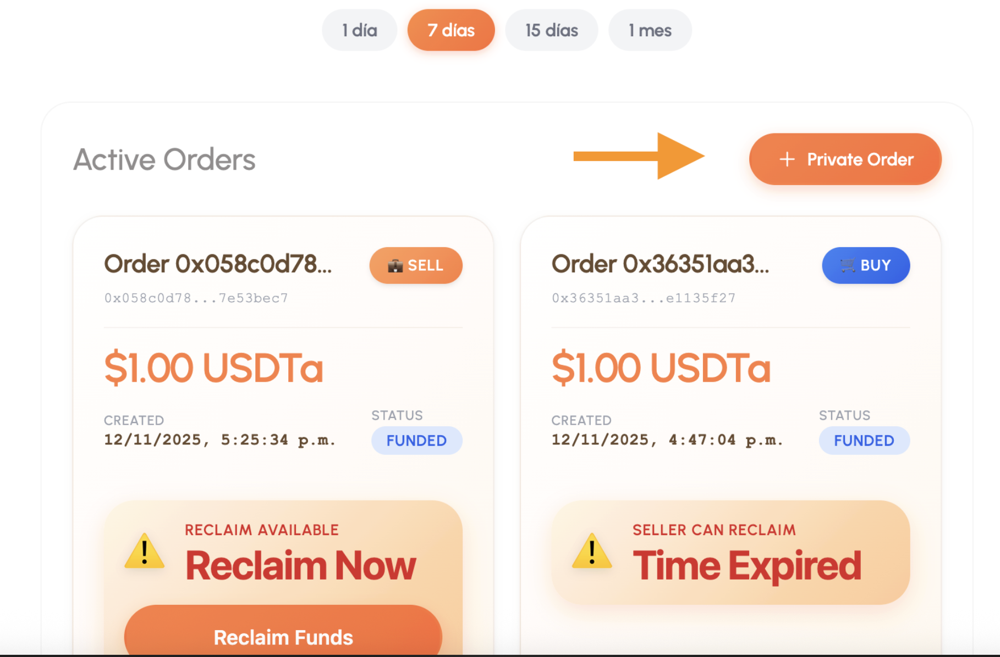

#  Orden Privada

## Crear una orden privada (Dirigida a una contraparte de confianza)

Las órdenes privadas son la herramienta ideal cuando ya tienes un comprador o vendedor de confianza y deseas utilizar el **escrow inteligente** de Achylo para proteger la transacción de extremo a extremo.

### Pasos para crear el Escrow:

1.  **Acceso:** En el panel principal, dirígete a la pestaña **“Active Orders”**.
2.  **Iniciar proceso:** Pulsa el botón **“Private Order”** ubicado en la parte superior derecha.
3.  **Configurar el modal “Create New Escrow”:** Completa los campos requeridos:
    * **Cantidad USDC:** Indica el monto que vas a vender (estos fondos se bloquearán en el contrato hasta que decidas liberarlos).
    * **Counterparty Address:** Pega la dirección de la wallet de tu contraparte (quien recibirá los USDC al finalizar).
    * **Exchange Rate (per 1 USDC):** Define la tasa de cambio fiat acordada.
    * **Fiat Currency:** Selecciona la moneda fiat correspondiente.
    * **Fiat Card Details:** Ingresa tus datos bancarios o el método donde recibirás el pago.
    * **Reclaim Timeout (Opcional):** Tiempo en minutos para recuperar tus fondos si la transacción se estanca (mínimo 30 minutos por defecto).
4.  **Flujo de confirmación:** Sigue los pasos que indica el botón principal de forma secuencial:
    * **Step 1:** Create Escrow.
    * **Step 2:** Fund Escrow.
5.  **Finalización:** Confirma cada transacción en tu wallet. La app te mostrará notificaciones (*toasts*) indicando el progreso (ej. “Escrow created…”, “Escrow funded…”).

---

###  Consideraciones Importantes
* **Privacidad:** Las órdenes privadas **no aparecen en el marketplace público**. Solo la contraparte especificada podrá ver la orden en su tablero.
* **Notificaciones:** Si la contraparte tiene las notificaciones activadas, recibirá un aviso automático al momento de la creación.

###  Ventajas
* **Control total:** Tú eliges exactamente con quién operas.
* **Sin ruido:** Tu oferta se mantiene fuera del radar general del marketplace.
* **Seguridad:** Disfrutas de la misma protección de un contrato inteligente que en las órdenes públicas.

---

  

<strong>📍 Img. No.1. Vista del modal 'Create New Escrow'.</strong>
