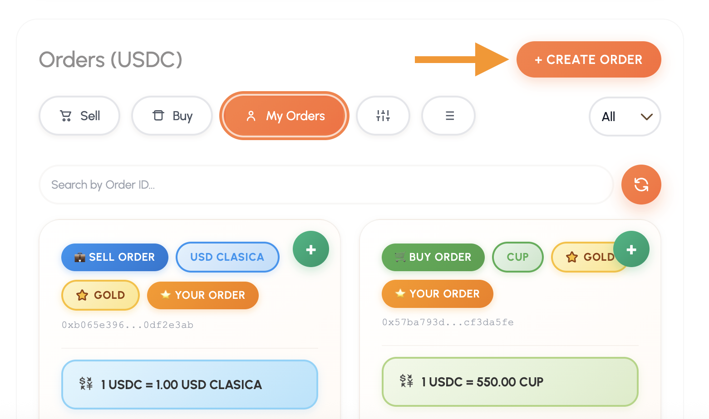
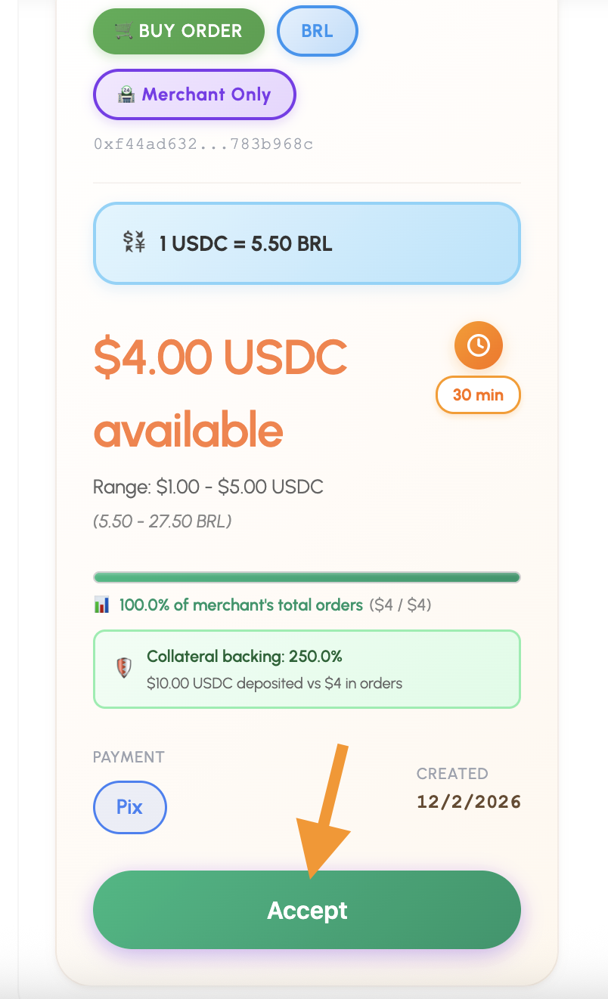

#  Gestión de Órdenes Públicas

##  Crear una orden pública 
> **Nota:** Esta función es exclusiva para usuarios con rol de **Merchant**. Si no visualizas el botón "Create Public Order", asegúrate de haber completado tu registro en el menú *Become a Merchant*.

###  Capacidad de Orden y Colateral
Al abrir el modal, verás un resumen de tu capacidad operativa basada en tu garantía:
* **Your Merchant Collateral:** El saldo total que has depositado como garantía.
* **Max order capacity (2x multiplier):** Achylo te permite publicar órdenes por un valor de hasta el **doble (2x)** de tu colateral.
* **Available:** Indica cuánto cupo te queda disponible para nuevas órdenes tras descontar las órdenes activas.

### Pasos para configurar el modal:

1. **Order Type (Tipo de orden):**
   * **Buy USDC:** Compras USDC y entregas fiat.
   * **Sell USDC:** Vendes USDC y recibes fiat.

2. **Fiat Currency (Moneda):** Selecciona la divisa de intercambio.
   * *Opciones destacadas:* **CUP**, **CUBT** (aplica 50% de descuento), **MLC**, **USD Clásica**, **COP**, **USD**, **EUR**, **GBP**, **MXN**, **ARS**, entre otras.

3. **Exchange Rate (Tasa de cambio):** * Define cuánto fiat pagas/recibes por cada 1 USDC. 
   * *Rango válido:* 0.01 - 1,000,000 por unidad.

4. **Límites por Transacción:**
   * **Min Amount :** Lo mínimo que un usuario puede aceptarte.
   * **Max Amount :** Lo máximo que un usuario puede aceptarte en una sola operación.

5. **Total Available Amount :** * Es el monto total de la orden. 
   * **Importante:** Para órdenes de compra (*Buy*), no se bloquean tokens de tu wallet, se usa tu capacidad de colateral.

6. **Payment Method (Métodos de Pago):**
   * Selecciona hasta **5 métodos** distintos (ej. Zelle, Pix, Bandec, Transferencia).

7. **Reclaim Timeout :**
   * Tiempo que tiene el comprador para completar el pago antes de que el vendedor pueda reclamar los fondos.
   * *Rango:* Desde 15 minutos hasta 28 días. Si se deja vacío, aplica el valor por defecto.

8. **🏪 Merchant Only:** * Si activas esta casilla, **solo otros merchants registrados** podrán ver y aceptar tu orden, brindando una capa extra de seguridad.

---

##  Aceptar una orden pública
1. **Selección:** En el tab **“Marketplace”**, pulsa en **“Accept Order”**.
2. **Detalles:** Ingresa el monto (puedes usar el botón **MAX**) y tus datos de cobro si es una orden de tipo *Buy*.
3. **Revisión:** La app aplicará automáticamente descuentos si usas **CUBT**.
4. **Confirmación:** Pulsa **“Accept Order”** para crear el *escrow* seguro.

---

  

<strong>📍 Img. No.1. Vista de Create Public Order.</strong>

#  Aceptar una Orden Pública

Si has encontrado una oferta que se ajusta a tus necesidades, sigue estos pasos para realizar el intercambio de forma segura:

### Pasos para realizar la operación:

1.  **Búsqueda:** Localiza la orden de tu interés en el marketplace. Puedes utilizar los **filtros** para segmentar por moneda fiat o tipo de operación.
2.  **Selección:** Asegúrate de estar en la pestaña **“Marketplace”** y haz clic en el botón **“Accept Order”** de la publicación elegida.
3.  **Configuración del monto:**
    * Introduce la cantidad que deseas transaccionar. 
    * El monto debe estar dentro del rango **mínimo y máximo** definido por el Merchant.
    * Puedes usar el botón **MAX** para tomar todo el cupo disponible de la orden.
4.  **Datos de cobro:** * Si estás aceptando una orden de tipo **Buy** (donde tú vendes USDC), deberás ingresar los datos de tu cuenta o tarjeta donde el Merchant debe enviarte el dinero fiat.
5.  **Revisión y Tarifas:** * Verifica el resumen detallado de la transacción. 
    * La aplicación te mostrará automáticamente los **descuentos en comisiones** si estás operando con **CUBT**.
6.  **Confirmación:** Pulsa **“Accept Order”**. 
    * Una vez procesado, la dApp te enviará una notificación confirmando que el **escrow** (contrato inteligente de garantía) se ha creado con éxito.

---

###  Órdenes “Merchant Only”
Algunas órdenes están restringidas y solo pueden ser aceptadas por usuarios que ya tienen el estatus de **Merchant**. 
* Si ves una **advertencia roja** en una orden, significa que es exclusiva para comerciantes. 
* Si deseas acceder a ellas, debes registrarte previamente en el menú *Become a Merchant*.

---

  

<strong>📍 Img. No.1. Vista del modal 'Create Public Order.</strong>

##  Aceptar una Orden Pública

Si has encontrado una oferta que se ajusta a tus necesidades, sigue estos pasos para realizar el intercambio de forma segura:

### Pasos para realizar la operación:

1.  **Búsqueda:** Localiza la orden de tu interés en el marketplace. Puedes utilizar los **filtros** para segmentar por moneda fiat o tipo de operación.
2.  **Selección:** Asegúrate de estar en la pestaña **“Marketplace”** y haz clic en el botón **“Accept Order”** de la publicación elegida.
3.  **Configuración del monto:**
    * Introduce la cantidad que deseas transaccionar. 
    * El monto debe estar dentro del rango **mínimo y máximo** definido por el Merchant.
    * Puedes usar el botón **MAX** para tomar todo el cupo disponible de la orden.
4.  **Datos de cobro:** * Si estás aceptando una orden de tipo **Buy** (donde tú vendes USDC), deberás ingresar los datos de tu cuenta o tarjeta donde el Merchant debe enviarte el dinero fiat.
5.  **Revisión y Tarifas:** * Verifica el resumen detallado de la transacción. 
    * La aplicación te mostrará automáticamente los **descuentos en comisiones** si estás operando con **CUBT**.
6.  **Confirmación:** Pulsa **“Accept Order”**. 
    * Una vez procesado, la dApp te enviará una notificación confirmando que el **escrow** (contrato inteligente de garantía) se ha creado con éxito.

---

###  Órdenes “Merchant Only”
Algunas órdenes están restringidas y solo pueden ser aceptadas por usuarios que ya tienen el estatus de **Merchant**. 
* Si ves una **advertencia roja** en una orden, significa que es exclusiva para comerciantes. 
* Si deseas acceder a ellas, debes registrarte previamente en el menú *Become a Merchant*.

---

  

<strong>📍 Img. No.2. Aceptar una orden pública</strong>
